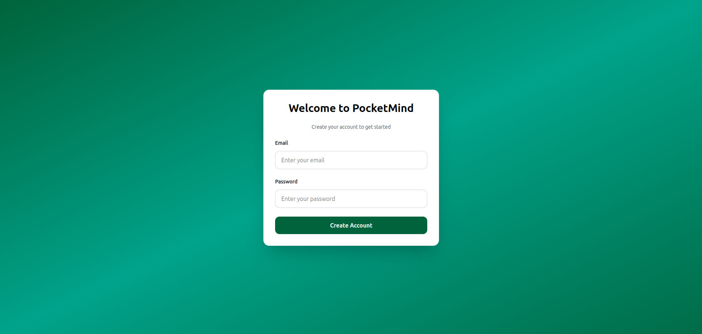
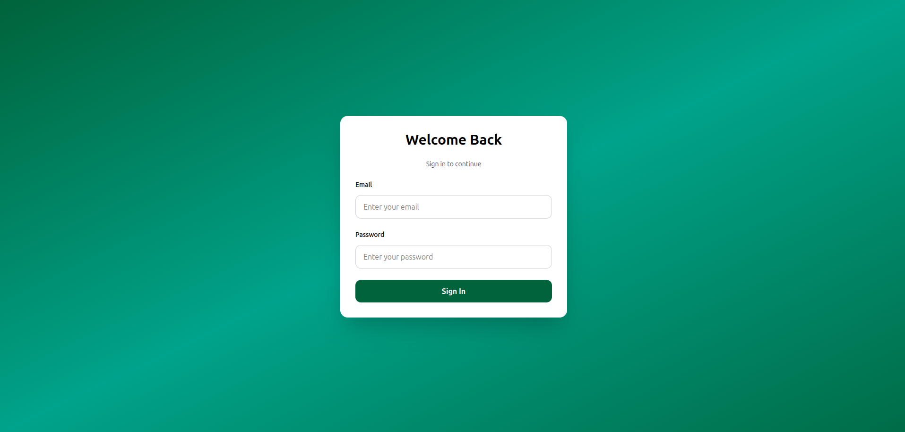
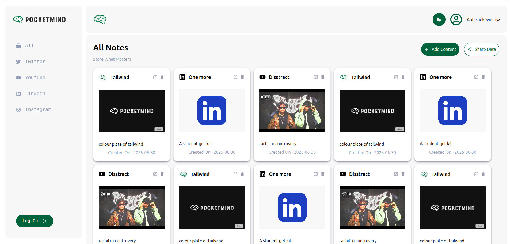
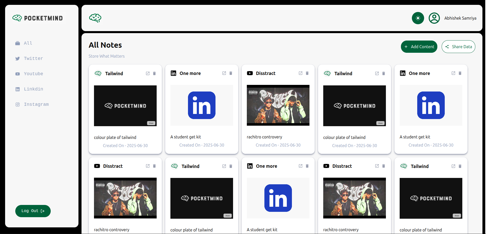
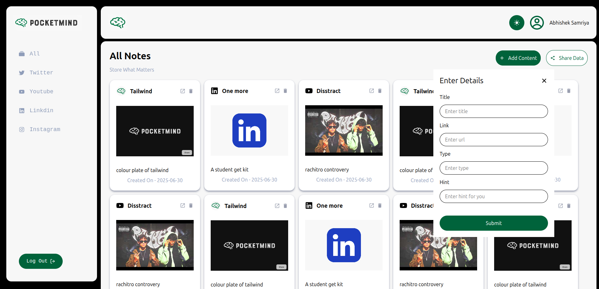
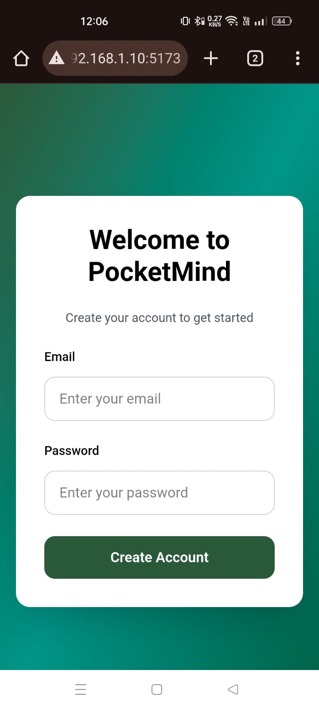
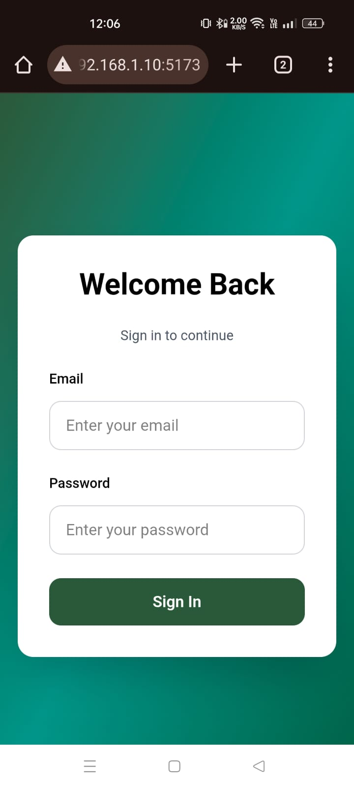
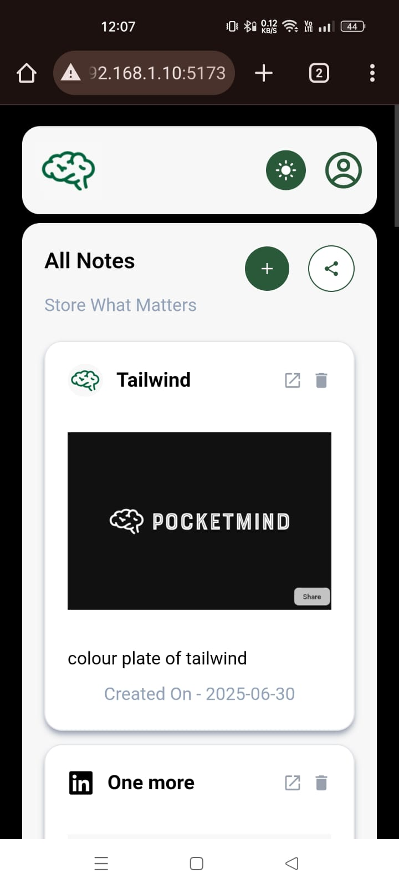
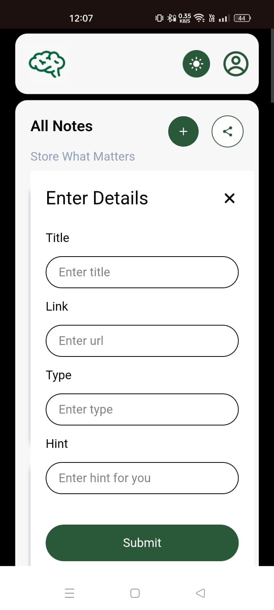

# 🧠 PocketMind - Save & Organize Your Important Links

PocketMind is a web application that helps you save, organize, and manage your important links from platforms like **YouTube**, **Twitter**, **LinkedIn**, and more. Built with a clean, modern UI and a secure backend, PocketMind acts as your digital brain to collect and store important resources.

---

## ✨ Features

- ✅ Save & manage important links
- ✅ Fully responsive, mobile-friendly design
- ✅ Secure authentication system with JWT
- ✅ Clean, minimal UI using TailwindCSS
- ✅ Organized folder structure for easy development
- ⚒️ Sidebar links - _Coming Soon_
- ⚒️ Filter All Available Links - _Coming Soon_
- ⚒️ Logout functionality - _Coming Soon_
- ⚒️ Share Brain (Link Sharing) feature - _Coming Soon_

---

## 🚀 Tech Stack

**Frontend:**

- React
- TypeScript
- TailwindCSS
- React Router
- Axios

**Backend:**

- Node.js
- Express.js
- TypeScript
- MongoDB with Mongoose
- JWT Authentication
- Zod for validation
- bcrypt for password security

---

PocketMind/
├── backend/
│ ├── src/
│ │ ├── middlewares/
│ │ ├── models/
│ │ ├── routes/
│ │ └── index.ts
│ ├── package.json
│ └── tsconfig.json
│
├── frontend/
│ ├── src/
│ │ ├── assets/
│ │ ├── components/
│ │ ├── pages/
│ │ ├── App.tsx
│ │ ├── main.tsx
│ │ └── config.ts
│ ├── package.json
│
└── README.md

## How to initialize

after cloning to repo
make sure to create .env for both frontend and backend

for backend .env
DATABASE_URL=`give data base url`
PORT=portnumber
SECRET_KEY=key

for frontend .env
VITE_API_URL='here give url of backend'

## Backend Setup

cd backend
npm install
npm run dev

## Frontend Setup

cd frontend
npm install
npm run dev

## Screenshots

### 🔹 Sign Up Page

### 🔹 Sign In Page

### 🔹 Dashboard

### 🔹 Mobile View

